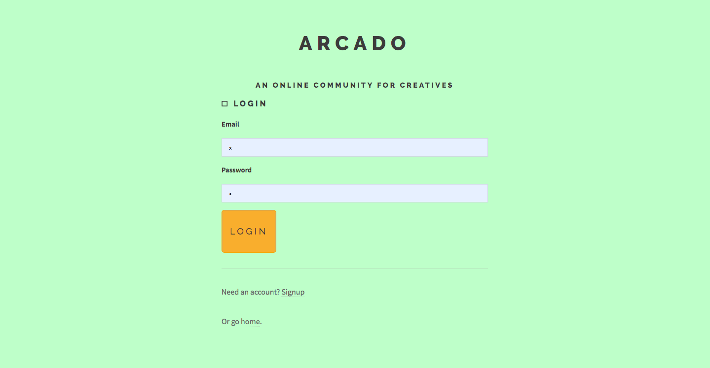
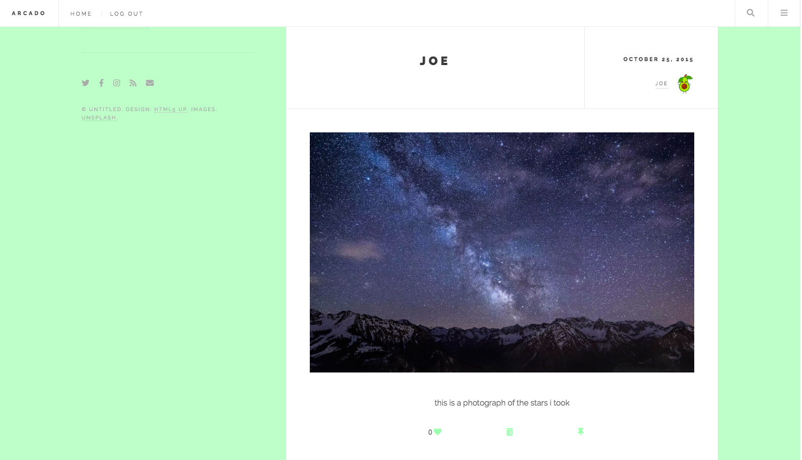

## About

1. Arcado is a social media platform geared towards creatives where they can share art and interact with eachother.

## Usage

1. run `node server.js`
2. Navigate to `localhost8080`
3. Login Username - x
4. Login Password - x

## Tech Used
1. HTML5, CSS3, JavaScript, MongoDB, Node, Express

## Sign Up Page

## Login Page

## Home Page

## Profile Page

## Individual User Pages

## Direct Messages

# Arcado
